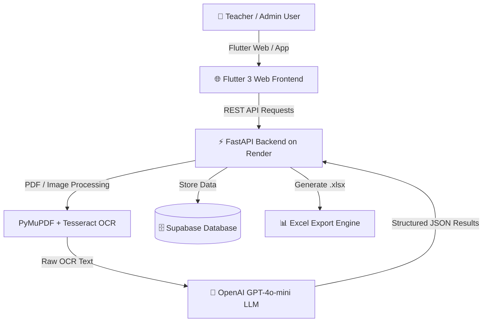

<div align="center">

# 📊 Marksheet Analytics App — College Edition

An AI-powered, end-to-end college marksheet scanner and academic analytics platform. Automatically extract student marks from scanned PDF marksheets, calculate SGPA/CGPA, generate class analytics, and export formatted Excel reports.

[](https://maheshdakulge.github.io/marksheet-auto/)
[](https://marksheet-analytics-api.onrender.com/)

---


</div>

---

## 🌟 Live Demo & Quick Links

- 🚀 **Live Web Application**: [https://maheshdakulge.github.io/marksheet-auto/](https://maheshdakulge.github.io/marksheet-auto/)
- ⚙️ **Backend Health Endpoint**: [https://marksheet-analytics-api.onrender.com/](https://marksheet-analytics-api.onrender.com/)
- 📦 **GitHub Repository**: [https://github.com/MaheshDakulge/marksheet-auto](https://github.com/MaheshDakulge/marksheet-auto)

---

## 💡 What It Does & Key Features

College examination departments and professors spend hundreds of hours manually entering grades from physical/scanned marksheets. **Marksheet Analytics** automates this process end-to-end:

### 1. 🔍 Hybrid AI OCR Scanner
- **PDF & Image Support**: Converts multi-page marksheets (PNG, JPG, PDF) into crisp high-resolution images via **PyMuPDF**.
- **Local OCR Extraction**: Uses **Tesseract OCR** for instant local character extraction.
- **LLM Error Correction**: Leverages **GPT-4o-mini** to intelligently fix OCR noise, parse tabular course codes, marks, credits, and SGPA/CGPA.

### 2. 📊 Automated Grade & SGPA/CGPA Analytics
- **Semester & Full-Year Modes**: Supports single semester marksheets as well as combined annual transcripts.
- **Performance Dashboards**: View pass/fail percentages, class topper lists, subject-wise grade distributions, and trends.

### 3. 📥 One-Click Excel Export
- Generates formatted Excel spreadsheets (`.xlsx`) matching official college templates.
- Instant download for faculty record-keeping and official submission.

### 4. 🔒 Role-Based Security & Storage
- Authentication powered by **Supabase Auth** with JWT token security.
- Cloud database storing projects, student records, and extraction templates.

---

## 🏗️ Architecture Overview



---

## 💻 Local Development Setup

### 1. Clone Repository
```bash
git clone https://github.com/MaheshDakulge/marksheet-auto.git
cd marksheet-auto
```

### 2. Run Backend (FastAPI)
```bash
cd backend
python -m venv venv
# On Windows: venv\Scripts\activate | On Linux/macOS: source venv/bin/activate
pip install -r requirements.txt
uvicorn app.main:app --reload --host 0.0.0.0 --port 8000
```

### 3. Run Frontend (Flutter Web)
```bash
cd marksheet_analytics
flutter pub get
flutter run -d chrome
```

---

## 🚢 Deployment Architecture

- **Frontend**: Automatically built and published to **GitHub Pages** using GitHub Actions (`.github/workflows/deploy-web.yml`).
- **Backend**: Containerized with **Docker** (Ubuntu Slim + Tesseract OCR + Poppler) and deployed on **Render**.

---

## 👤 Author & Support

Developed by **Mahesh Dakulge**.
For inquiries, contributions, or feedback, visit the [GitHub Repository](https://github.com/MaheshDakulge/marksheet-auto).
